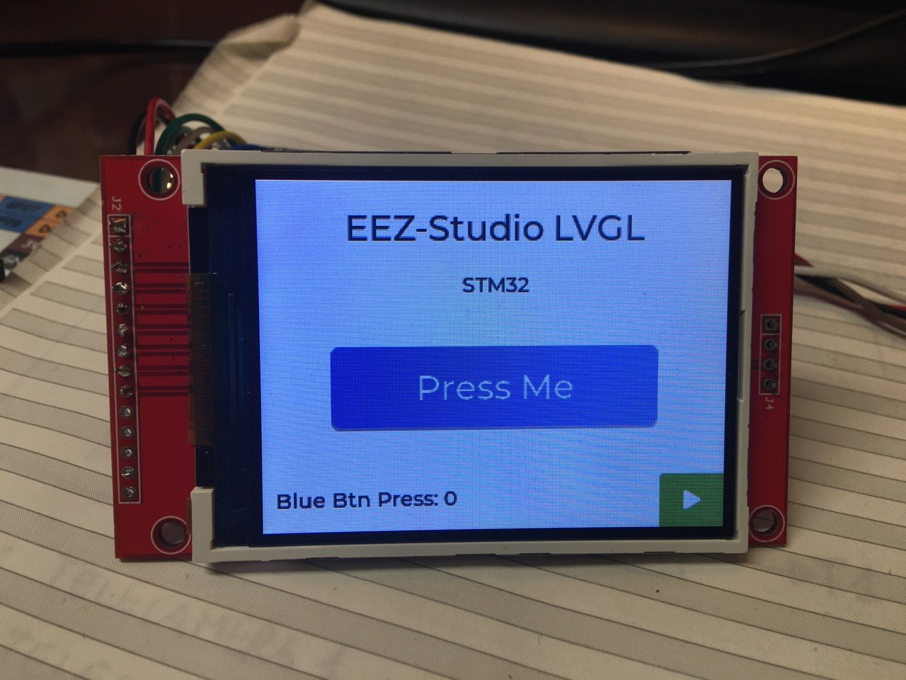
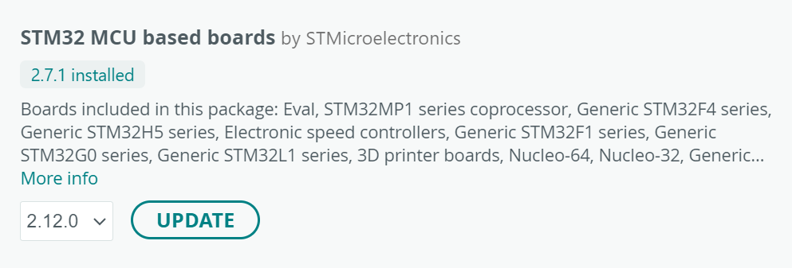
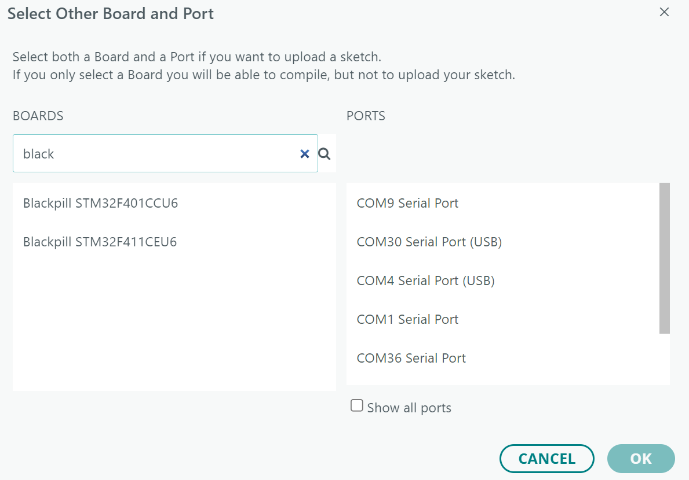
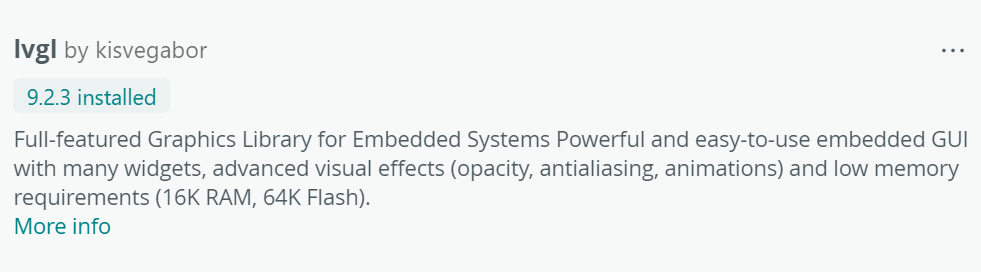

## Demo Video

[](https://www.youtube.com/watch?v=Lx8yKO_QNRM)

*Clicca sull'immagine per aprire la demo su YouTube...*

Questo repo contiene il porting verso Arduino di questo progetto 

<https://github.com/itarozzi/stm32_nucleo_lvgl_minimal>

scritto da Ivan Tarozzi su ST CubeMX, come esperimento.

Il porting è stato eseguito in modo automatico con OpenAI Codex.

Ho clonato il repo in locale e poi ho chiesto a Codex di fare prima un'analisi del codice estrapolando le parti importanti ai fini del porting.

Fare riverimento al README.md della cartella porting_arduino_minimal , per i dettagli.

## Dipendenza LVGL

Questo progetto e' stato provato con `LVGL v9.2.2`.

- release ufficiale: <https://github.com/lvgl/lvgl/releases/tag/v9.2.2>
- download ZIP diretto: <https://github.com/lvgl/lvgl/archive/refs/tags/v9.2.2.zip>

Lo ZIP non e' piu' incluso nel repository per evitare di appesantire inutilmente Git.


## Board Arduino
- core ufficiale `STM32 MCU based boards`
- board `Generic STM32F4 -> BlackPill F411CE`
- upload via ST-Link clone.
- ricordarsi di abilitare "seriale USB CDC" nelle opzioni board

Se non abiliti `CDC`, il backend mouse via seriale dal PC non puo' funzionare.

## Note display
- flush LVGL via SPI bloccante
- niente DMA
- display e touch condividono lo stesso bus SPI
- orientamento landscape

## Mouse dal PC via seriale
Il progetto puo' ricevere un puntatore dal PC via seriale USB e usarlo come input LVGL.

Se arrivano pacchetti seriali validi, hanno priorita' sul touch XPT2046.

Configurazione:

- abilita/disabilita in [board_config.h](./porting_arduino_minimal/board_config.h) con `BOARD_ENABLE_SERIAL_MOUSE`
- baudrate in `BOARD_SERIAL_BAUDRATE`

Protocollo:
- una riga per aggiornamento
- formato: `M x y b`
- `x`: coordinata X in pixel
- `y`: coordinata Y in pixel
- `b`: `0` rilasciato, `1` premuto

Esempi:
```text
M 120 80 0
M 140 90 1
M 140 90 0
```

Dopo circa 1 secondo senza pacchetti, il backend seriale si disattiva e torna attivo il touch normale.


## Prerequisiti

Installare nell'IDE Arduino la Board STM32 ufficiale di ST-Microelectronics (no STMDuino)



E scegliere come scheda una "Generic STM32F4" e come sotto scheda una BlackPill F411CE.

La mia Black Pill ha a bordo STM32F411CEU6, e l'ho acquistata qui per circa 4 euro
<https://www.aliexpress.com/item/1005005953179540.html>



Poi installare la libreria `LVGL` per Arduino usando la release ufficiale `v9.2.2` indicata sopra.


Qui [Schematic.pdf](./Kicad/Schematic.pdf) trovi un semplice schema che da un'idea delle connessioni.

Per il mouse dal PC serve anche Python sul PC con:

```bash
pip install pyserial pynput
```
